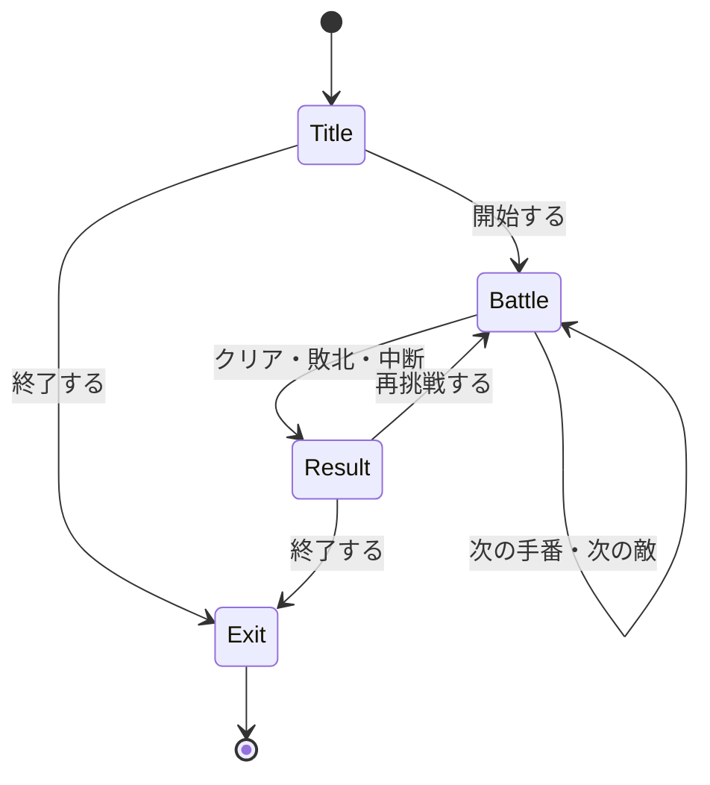

# コンソールRPGを理解して、あとから思い出すための解説

このガイドは、完成したコードを少しずつ読み、「どこで、何のために、その書き方を使ったか」を思い出せるようにまとめたものです。最初から全部を覚える必要はありません。まず実行し、その後で `Character` と最初の戦闘だけを追ってみてください。

コードを読んでわかった気がするときは、「数値を変えたら何が変わるか」を実行前に予想すると、理解を確かめやすくなります。

## 1. まず、このゲームがすること

勇者がスライム、ゴブリン、ドラゴンと順番に戦います。戦闘中は「通常攻撃」「回復薬」「防御」「強攻撃」「冒険をやめる」を選べます。敵を3体倒せばクリア、勇者のHPが0になればゲームオーバーです。

| 対象 | 基準の最大HP | 攻撃力 |
| --- | ---: | ---: |
| 勇者 | 100 | 12 |
| スライム | 32 | 6 |
| ゴブリン | 50 | 10 |
| ドラゴン | 110 | 20 |

回復薬は最初に2個あり、1個でHPを25回復します。気力は3で始まり、強攻撃には2必要です。敵HPとダメージは毎回変わります。新しい戦闘ルールの詳細は16節を参照してください。

- 攻撃して敵が生き残れば、予告された敵の行動を実行します。
- 回復薬を使えたときも敵の行動に進みます。敵が防御・息切れ中なら反撃されません。
- 回復薬がないときや、HPが満タンのときは、回復薬を使っても手番を失いません。
- 入力ミスでは手番を失わず、もう一度入力できます。
- 結果画面で再挑戦すると、勇者のHP、回復薬、気力、倒した敵の数が最初の状態に戻ります。

## 2. 課題の6つの技術は、ここにある

| 技術 | このゲームでの仕事 | 主に読むファイル |
| --- | --- | --- |
| コンストラクタ | 作られたキャラクターを、使える初期状態にする | [Character.h](Character.h)、[Character.cpp](Character.cpp) |
| ファクトリーパターン | 敵のIDから、戦闘で使える敵を用意する | [EnemyFactory.h](EnemyFactory.h)、[EnemyFactory.cpp](EnemyFactory.cpp) |
| データテーブル | 敵の名前・HP・攻撃力を一覧にする | [EnemyDataTable.h](EnemyDataTable.h)、[EnemyDataTable.cpp](EnemyDataTable.cpp) |
| シングルトン | 敵データの一覧を、同じ1個の管理オブジェクトから読む | [EnemyDataTable.cpp](EnemyDataTable.cpp) |
| 有限状態機械 | タイトル・戦闘・結果・終了を切り替える | [GameState.h](GameState.h)、[Game.cpp](Game.cpp) |
| オブジェクトプール | 用意しておいた敵を借り、返し、再利用する | [EnemyPool.h](EnemyPool.h)、[EnemyPool.cpp](EnemyPool.cpp) |

ファクトリーの実装は、IDに応じて敵を用意する「シンプルファクトリー」の形です。継承したクラスごとに生成関数を差し替える、GoFの厳密な「Factory Method」とは構成が異なります。課題で特定の書き方が指定されている場合は、その指定と照らし合わせてください。

## 3. ファイルを読む順番

次の順番だと、小さな部品から全体へつながります。

1. [Character.h](Character.h) と [Character.cpp](Character.cpp)：名前、HP、攻撃力。
2. [Player.h](Player.h) と [Player.cpp](Player.cpp)：勇者と回復薬。
3. [Enemy.h](Enemy.h) と [Enemy.cpp](Enemy.cpp)：再利用できる敵。
4. [EnemyDataTable.h](EnemyDataTable.h) と [EnemyDataTable.cpp](EnemyDataTable.cpp)：敵の設定。
5. [EnemyPool.h](EnemyPool.h) と [EnemyPool.cpp](EnemyPool.cpp)：敵の貸し借り。
6. [EnemyFactory.h](EnemyFactory.h) と [EnemyFactory.cpp](EnemyFactory.cpp)：設定と貸し借りをつなぐ。
7. [GameState.h](GameState.h) と [Game.cpp](Game.cpp)：戦闘と画面の進行。
8. [RPG.cpp](RPG.cpp)：全体を起動する入口。

### `.h` と `.cpp` は何が違うのか

ヘッダー `.h` は、「このクラスは何を持ち、どの関数が使えるか」を知らせます。ソース `.cpp` は、「その関数が実際にどう動くか」を書きます。

たとえば、ヘッダーの次の行は関数の**宣言**です。

```cpp
bool IsAlive() const;
```

ソースにある次の形は、その関数の**定義**です。

```cpp
bool Character::IsAlive() const
{
    return hp_ > 0;
}
```

`Character::` は、「これは `Character` に属する関数」という意味です。ヘッダーに宣言しただけでは、処理の中身はまだ存在しません。

以前のようにクラス内に関数の中身まで書くこともできます。今回はファイルごとの役割を見やすくするため、主な処理を `.cpp` に分けています。

### `#include` は何のためか

- `<string>` は、標準ライブラリの `std::string` を使うためのものです。
- `"Character.h"` は、このプロジェクトの `Character` の宣言を読み込むものです。
- `#pragma once` は、同じヘッダーの内容が繰り返し読み込まれるのを防ぎます。

ヘッダーは、自分が使う型に必要なヘッダーを自分で読み込みます。たまたま別のファイルで読み込まれていることに頼らない形です。

`Enemy.h` の `struct EnemyData;` は**前方宣言**です。「その名前の型がある」ことだけを先に伝えます。参照を引数にする宣言だけなら、まだ型の中身は必要ありません。`Enemy.cpp` で `data.name` などを読む段階では中身が必要になるので、そこで `EnemyDataTable.h` を読み込みます。

## 4. `Character`：以前書いたクラスから何が変わったか

以前は `name` と `hp` を外から直接触れました。完成版では、名前・現在HP・最大HP・攻撃力を `private` に置き、決まった関数を通して使います。

| メンバ | 意味 |
| --- | --- |
| `name_` | 表示する名前 |
| `hp_` | 現在のHP |
| `maxHp_` | 回復できる上限 |
| `attack_` | 与えるダメージの基本値 |

末尾の `_` は、メンバ変数だとわかりやすくする命名の決めごとです。C++の必須ルールではありません。

以前の自分のコードから、大きく変わった点は3つあります。

- コンストラクタの引数が、名前・HPの2つから、名前・最大HP・攻撃力の3つになった。
- 名前とHPを直接読む代わりに、`GetName()`、`GetHp()` で読むようになった。
- `TakeDamage` が、戻り値なしの `void` から、実際の減少量を返す `int` になった。

名前を表示する `player.name` は、完成版では `player.GetName()` です。取得用の関数は「ゲッター」と呼びます。`GetMaxHp()`、`GetAttack()` も同じように、保存されている値を読むための関数です。

### 変数の宣言と、コンストラクタの違い

`int hp_;` は「HPを入れる変数を持つ」と決める**宣言**です。コンストラクタは「このキャラクターのHPはいくつで始まるか」を決める**初期化**です。

同じクラスから、違う状態のキャラクターを作れます。

```cpp
Character hero("勇者", 100, 12);
Character slime("スライム", 32, 6);
```

ここで起きることは次のとおりです。

1. `hero` を作るために、名前・HP・攻撃力を渡す。
2. `Character` のコンストラクタが自動で呼ばれる。
3. 名前は「勇者」、現在HPと最大HPは100、攻撃力は12で始まる。

コンストラクタはクラスと同じ名前で、`void` を含めて戻り値の型を書きません。

### コロン `:` の後ろは、メンバ初期化リスト

コンストラクタの `:` の後ろにある部分が、メンバ初期化リストです。

```cpp
: name_(name), hp_(std::max(1, maxHp)), maxHp_(hp_), attack_(std::max(0, attack))
```

読み方は「`name_` を `name` で初期化する」です。`std::max(a, b)` は、大きいほうの値を返します。最大HPは最低でも1、攻撃力は最低でも0に調整しています。先に初期化された `hp_` を、`maxHp_` の初期値にも使っています。

初期化リストでは、メンバを最初からその値で作ります。関数の `{ }` の中で代入する方法は、メンバが先に初期化された後、値を書き換えます。数値だけでは違いが見えにくくても、文字列や別のクラスをメンバにすると、この区別が役立ちます。

**メンバが初期化される順序は、クラス内で宣言した順序**です。初期化リストの見た目の順序ではありません。両方を同じ順序にすると読み違えにくくなります。

### `public`、`private`、`protected`

| 指定 | 誰が使えるか | このゲームでの例 |
| --- | --- | --- |
| `public` | クラスの外側から使える | HPを取得する関数、`TakeDamage` |
| `private` | そのクラス自身の関数から使える | `hp_` などの中身 |
| `protected` | そのクラス自身と、継承したクラスから使える | `ResetStats` |

HPを `private` にすると、外からいきなり `hp_ = -100;` と書けなくなります。ダメージを受けるときは `TakeDamage`、回復するときは `Heal` を通すので、HPの範囲を保つ処理を一か所に集められます。

`ResetStats` は再挑戦や敵の再利用に必要ですが、普通の戦闘操作として誰でも呼べる必要はありません。そのため、継承先から使える `protected` にあります。

### `TakeDamage` は、実際に減ったHPを返す

HPが5しかない相手に12ダメージを与えても、実際に減るHPは5です。完成版ではこの実際の減少量を `int` で返します。

以前の `void` 版からの違いは、呼び出す側が「何ダメージ与えた」と正確に表示できることです。

| 呼ぶ前のHP | 渡すダメージ | 呼んだ後のHP | 戻り値 |
| ---: | ---: | ---: | ---: |
| 30 | 12 | 18 | 12 |
| 5 | 12 | 0 | 5 |
| 30 | 0 | 30 | 0 |
| 30 | -10 | 30 | 0 |

0以下のダメージは何もしません。「マイナスのダメージで回復してしまう」といった意図しない動きを防ぎます。

中にある `std::min(hp_, damage)` は、現在HPと指定ダメージの小さいほうを選びます。これで残りHPより多く減らせなくなります。`std::min` と `std::max` を使うためのヘッダーが `<algorithm>` です。

### `Heal` と `IsAlive`

`Heal` は最大HPを超えないように回復し、実際に増えたHPを返します。HP90・最大HP100で25回復しても、結果は100で、戻り値は10です。HP0のキャラクターや、0以下の回復量では回復しません。このゲームの回復薬には蘇生の効果がないためです。

`IsAlive` は `hp_ > 0` の結果を返します。比較式そのものの型が `bool` なので、`if` で `true` と `false` を分けなくても表せます。

### `const` をどこに付けるか

以前質問していた `const` は、ここに付いています。

```cpp
bool IsAlive() const;
```

括弧の後ろの `const` は、「この関数では、このオブジェクトの通常のメンバ変数を変更しない」という約束です。名前やHPを読む関数にも付けています。HPを変える `TakeDamage` や `Heal` には付けられません。

引数にある `const EnemyData& data` は別の意味です。

- `&`：データをコピーせず、元のデータを参照する。
- `const`：この参照を通してデータを変更しない。

`const` を見たら、まず「関数の括弧の後ろか」「変数や引数の型の一部か」を確認してください。

## 5. `Player` と `Enemy`：共通部分を継承する

`Player` も `Enemy` も、名前・HP・攻撃力とダメージ処理を持ちます。共通部分を `Character` にまとめ、次の形で継承しています。

```cpp
class Player : public Character
```

これは「`Player` は `Character` の性質を持つ」という意味です。`Player` は `TakeDamage` や `IsAlive` を自分でもう一度書かずに使えます。

`Player` のコンストラクタの初期化リストにある `Character(...)` は、基底クラスのコンストラクタを呼ぶものです。コンストラクタがそのまま継承されるという意味ではありません。先に `Character` の部分を初期化し、その後で `Player` のメンバを初期化します。

### 勇者にだけあるもの

勇者には回復薬の個数があります。回復薬を使う関数は、次の条件を確認します。

1. 勇者は生きているか。
2. 回復薬は残っているか。
3. HPは満タンではないか。
4. 使えるときだけ回復し、回復薬を1個減らす。

関数名は `UsePotion`、残りの個数を読む関数は `GetPotionCount` です。実際のコードは、まず個数を確認し、次に `Heal(PotionHealing)` を呼びます。`PotionHealing` は現在25です。生存と満タンの確認は `Heal` に任せています。回復した量が0なら薬を減らさず、`Game` も敵の行動へ進みません。気力が足りない強攻撃も同様です。

`Reset` は再挑戦用です。勇者の能力を初期値に戻し、回復薬も2個、気力も3に戻します。

### 敵にだけあるもの

敵は、あとで別の種類として再利用します。そのため `Reset(const EnemyData& data)` で、名前・HP・攻撃力をデータテーブルの設定に入れ替えます。

「スライムを倒したら、そのオブジェクトをゴブリンの能力にし直す」ということです。単にHPを回復するだけでは、名前や攻撃力がスライムのままになってしまいます。

## 6. データテーブルとシングルトン

### `EnemyId` と `EnemyData`

`EnemyId` は、敵の種類を表すIDです。`Slime`、`Goblin`、`Dragon` のような名前で指定できます。

`EnemyData` は、敵1種類分の設定をまとめたデータです。ID・名前・基準HP・攻撃力・大技と防御の抽選確率が一組になっています。`EnemyDataTable` の配列に、このデータが3種類入っています。

戦闘中の「今のHP」は `Enemy` が持ち、設定上の「基準HP」はデータテーブルにあります。今回の戦闘では、その基準を90～110%に調整してEnemyに持たせます。敵がダメージを受けても、設定データそのものは減りません。

### データを一覧にすると何がうれしいか

スライムを強くしたいとき、戦闘の処理を変更せず、テーブルの数値を変更できます。設定を戦闘処理のあちこちに直接書かず、一か所で見比べられます。

`Find` は、指定されたIDのデータを探します。見つかればそのデータへのポインタ、見つからなければ `nullptr` を返します。ファクトリーは、見つからない場合にも対応します。

### 同じ一覧を共有する `Instance`

使う側は `EnemyDataTable::Instance()` から一覧を取得します。中では、関数内の `static` 変数としてインスタンスを持っています。

```cpp
static const EnemyDataTable instance;
```

普通の関数内変数は、呼び出しが終わると寿命が終わります。この `static` 変数は最初の呼び出しで一度作られ、その後も生き続けます。次の呼び出しでも同じものを返すので、敵データの管理オブジェクトを毎回作りません。

ヘッダーの `static const EnemyDataTable& Instance();` にある `static` は、「オブジェクトを先に作らなくても、クラス名から呼べる関数」の意味です。関数内変数の `static` と、同じ単語でも置く場所で役割が違います。

コンストラクタが `private` なのは、外から自由に別の一覧を作れないようにするためです。コピーの操作にある `= delete` は、「この操作は使えない」とコンパイラに伝えます。インスタンスをコピーして別物を作ることも防ぎます。

`= delete` と、オブジェクトを解放する `delete` 文は別物です。

この一覧は実行中に書き換えない設計です。シングルトンはこの課題で使っていますが、すべてのクラスをシングルトンにする必要はありません。

## 7. オブジェクトプールとファクトリーの連携

### プールは、敵の貸し出し場所

`EnemyPool` は、最初から2体分の `Enemy` を配列として持ちます。さらに、それぞれが「貸し出し中か」を記録します。

| 操作 | すること |
| --- | --- |
| `Acquire` | 空いている敵を探して、貸し出し中にし、そのアドレスを返す |
| `Release` | 借りた敵を返却して、次に貸せるようにする |
| `GetInUseCount` | 今借りられている数を数える |

貸せるものがなければ `Acquire` は `nullptr` を返します。プールの容量は有限なので、借りる側は失敗を考慮します。このゲームは通常1体ずつ戦うため、同時に必要なのは1体です。2体分の配列にして、貸し出しを管理する形を見られるようにしています。

`EnemyPool() = default;` は「コンパイラが作る通常のコンストラクタを使う」という指定です。敵の配列の各要素は `Enemy` のコンストラクタで作られ、貸し出し状態の `inUse_{}` は最初はすべて `false` になります。

この実装では、敵を出すたびに `new` したり、倒すたびに `delete` したりしません。プールに置かれた同じオブジェクトを使い直します。今回の小さなゲームでは、大きな速度の差を狙うより、再利用の仕組みを理解することが目的です。

### ファクトリーは、借りた敵を使える状態にする

`EnemyFactory` はコンストラクタで `EnemyPool&` を受け取ります。ゲームが持つプールを参照し、別のプールをコピーして持つことはありません。

このコンストラクタの `explicit` は、プールからファクトリーへの意図しない自動変換を防ぐ指定です。まずは「引数を渡して、明示的にファクトリーを作る」という意味で覚えておけば、このコードを読めます。

`Create` の流れは次のとおりです。

1. 渡された敵IDを、データテーブルから探す。
2. データがなければ、失敗として `nullptr` を返す。
3. プールから敵を借りる。
4. 借りられなければ、失敗として `nullptr` を返す。
5. 借りた敵を、その敵IDのデータで `Reset` する。
6. 準備できた敵へのポインタを返す。

`Game` は「ゴブリンを用意して」と依頼でき、データの検索やプール内の空き探しまで自分で書く必要がありません。

### ポインタ `*`、アドレス `&`、アクセス `->`

```cpp
Enemy* enemy = factory.Create(EnemyId::Slime);
```

`Enemy*` は「敵そのもの」ではなく、「敵がどこにあるかを示すポインタ」です。この変数が敵を所有しているわけではありません。敵の本体はプールの配列にあります。

| 書き方 | 読み方 |
| --- | --- |
| `Enemy enemy;` | 敵そのものを作る |
| `Enemy* enemy;` | 敵を指すポインタを用意する |
| `&enemy` | 敵のアドレスを得る。ここでの `enemy` が敵そのものの場合 |
| `enemy.IsAlive()` | 敵そのものの関数を呼ぶ |
| `enemy->IsAlive()` | ポインタの先にある敵の関数を呼ぶ |
| `*enemy` | ポインタの先にある敵そのものを参照する |
| `nullptr` | 何も指していない |

`&` は文脈で意味が変わります。型の `EnemyPool&` なら参照、式の `&enemy` ならアドレスの取得です。

`enemy->IsAlive()` を呼ぶ前に、敵が取得できている必要があります。`nullptr` のまま `->` で使うことはできません。

### 返却と寿命が大切

プールへの返却は、敵オブジェクトの破棄ではありません。「ほかの戦闘で再利用してよい」という扱いに戻します。その後に古い借り手が触ると、再利用された別の敵を変更する可能性があります。

そのため `Game` は、敵を返したら `currentEnemy_` を `nullptr` に戻します。敵を倒したとき、途中でやめたとき、ゲームオーバーのとき、入力が終わったときも、借りたままにしないようにしています。

`Game` がプールを所有し、ファクトリーはそのプールを参照します。クラス内ではプールをファクトリーより先に宣言し、先に初期化します。参照先のプールが存在してから、ファクトリーを作るためです。

借りたポインタに `delete` を使ってはいけません。その敵は、プールが持つ配列の一部です。返すための操作は `Release` です。プール自体のコピーも禁止しており、別の場所へコピーしたために貸し出し先のアドレスが食い違うのを防いでいます。

## 8. 有限状態機械：画面の進行を管理する

### 状態と結果は別のもの

`GameState` は「今どの画面・処理にいるか」です。

| 状態 | 内容 |
| --- | --- |
| `Title` | 開始を待つ |
| `Battle` | コマンド入力と戦闘 |
| `Result` | 冒険の結果を表示する |
| `Exit` | 実行を終了する |

`GameResult` は「何が理由で結果画面に進んだか」です。`Clear`、`GameOver`、`Retired` を区別し、結果がまだない状態は `None` とします。ゲームオーバーもクリアも同じ結果画面を使えますが、表示する内容が違います。

`enum class` は、決められた名前の候補から値を選ぶ型です。`GameState::Battle` のように型の名前も付けるので、別の列挙型の値と区別できます。



入力が終了した場合は、どの入力画面でも `Exit` に進みます。

### `Run` と `switch`

`Run` は、終了状態になるまで繰り返します。その中の `switch` で現在の状態を調べ、対応する処理を呼びます。

- `Title` なら `HandleTitle`。
- `Battle` なら `HandleBattle`。
- `Result` なら `HandleResult`。

状態を変更すると、次の繰り返しで別の処理に進みます。結果表示まで戦闘関数から何段も呼び続ける必要はありません。

補助関数の名前も、役割で探せます。`StartNewGame` は勇者や討伐数をリセットして最初の敵を出し、`SpawnEnemy` は次の敵を取得します。`ReleaseEnemy` は敵を返してポインタを空にし、`ExitGame` は返却して終了状態にします。再挑戦はタイトルに戻らず、`StartNewGame` から新しい戦闘へ進みます。

`switch` の `break` は、通常はその `switch` を抜けるものです。ゲーム全体の終了と同じ意味ではありません。ゲーム全体は `state_` が `Exit` になり、ループが終わることで終了します。

### 入力を1行ずつ読む理由

入力は `std::getline` で1行まるごと読みます。前後の空白を取り除いてから、`"1"`、`"2"`、`"0"` といったコマンドと比べます。

`"1abc"` を「1を選んだ」と誤って扱わず、無効な入力としてもう一度尋ねられます。空行も無効です。入力の終わりであるEOFを受け取った場合は、入力を待ち続けず、敵を返却して終了します。

これを担当する補助関数が `ReadChoice` です。選べる数字を文字列で受け取り、正常な選択は整数の0・1・2など、入力終了は `-1` として返します。`std::string::npos` は「文字列内に見つからなかった」ことを表す値です。

## 9. スライム戦を、変わる数値で追う

勇者のHPは100、攻撃力は12です。スライムの基準HPは32、実際のHPは28～35になります。
以下は「スライムのHP32・会心なし・通常攻撃で11ダメージ」になった場合の一例です。
毎回この順番と数値になるわけではありません。

| 手番 | 敵の予告 | 選択 | 結果の例 | 勇者のHP |
| --- | --- | --- | --- | ---: |
| 1 | 通常攻撃 | 通常攻撃 | 11ダメージ。敵HP32→21。反撃5ダメージ | 100→95 |
| 2 | 大技 | 防御 | 敵の大技12ダメージを防御で6に軽減 | 95→89 |
| 3 | 息切れ | 強攻撃 | 強化された攻撃で残りHP21を削り切る。反撃なし | 89 |

3手目の強攻撃には気力2を使います。最大3から1になります。
倒したスライムを返し、同じプールの敵をゴブリンとして設定し直します。
ゴブリンの基準HPは50、今回のHPは45～55です。勇者のHP・気力・薬は引き継ぎます。

### ここで確かめたいこと

1. 今回のダメージを決めるのは、どのクラスか。
2. そのダメージでHPを減らし、0未満にならないようにするのは、どこか。
3. 大技の後に息切れとなることを決めるのは、どこか。
4. 倒したスライムをプールに返すのは、いつか。
5. 次の敵の基準HP50と、今回のHPを決める場所はそれぞれどこか。

1はCombatRandom、2はCharacter、3はGameのPrepareEnemyIntent、4は敵撃破後のReleaseEnemyです。
5はEnemyDataTableの設定と、GameのSpawnEnemyを見比べてください。

## 10. `RPG.cpp`：入口が短い理由

`main` は、Windowsでの日本語表示に必要なコンソールの設定を行い、`Game` を作って `Run` を呼びます。

```cpp
Game game;
game.Run(std::cin, std::cout);
```

`std::cin` は入力、`std::cout` は出力です。`Run` が入出力を引数でもらうため、コンソールで遊ぶ場合以外にも、用意した入力を与えて動作を確かめやすくなります。

ゲームの中身が `main` に詰まっていないのは、起動とゲーム進行を分けているためです。コンソール設定や表示環境の話と、ダメージ計算の話を別々に読めます。

## 11. 配列や繰り返しで迷ったとき

`std::array<Enemy, 2>` は、要素数が2の敵の配列です。`std::array<EnemyData, 3>` なら、敵データが3個入ります。

配列の添字は0から始まります。3要素なら、使える添字は0、1、2です。3は範囲の外になります。

`size()` は要素数を返します。添字で繰り返す場合、条件を「添字が要素数より小さい間」にします。「要素数以下」にすると、最後に範囲外を読む可能性があります。

`std::size_t` は、配列の要素数や添字などに使う整数型です。符号なしなので、通常の負の数を表す用途には使いません。HPやダメージに `int`、要素数や添字に `std::size_t` を使っているのは、扱う値の用途が違うためです。

`for (const auto& data : ...)` のような範囲 `for` は、「中のデータを一つずつ読む」と考えてください。`const auto&` は型を推定し、コピーせず、書き換えずに参照します。

データテーブルの `return &data;` が返すのは、配列の中の元のデータのアドレスです。`data` がコピーではなく参照なので、繰り返しのために一時的に作った別データのアドレスではありません。

小さな記号で止まったときは、次を参照してください。

| 記号や文 | 意味 | このゲームでの例 |
| --- | --- | --- |
| `!条件` | 条件の反対 | `!IsAlive()` は「生きていない」 |
| `条件A || 条件B` | どちらかが成り立つ | 回復量が0以下、または死んでいる |
| `条件A && 条件B` | 両方が成り立つ | 自分の枠であり、貸し出し中である |
| `==` | 同じかを比較 | 状態が `Battle` か |
| `=` | 値を代入 | 状態を `Battle` に変える |
| `++値` | 値を1増やす | 倒した数を増やす |
| `--値` | 値を1減らす | 回復薬の数を減らす |
| `return` | 現在の関数を抜ける | 回復できなければ、この手番の処理を止める |

`Game.cpp` 冒頭の名前のない `namespace` は、敵の出現順や入力の補助関数を、そのソースファイル内だけで使うためのものです。敵の出現順の配列名は `EncounterOrder` です。

## 12. よくあるエラーと、最初に見る場所

下の番号は、Visual StudioのC++コンパイラで見かけるものです。メッセージの具体的な文面も読み、いちばん最初のエラーから直してください。後ろのエラーは、先頭の間違いが原因で続いている場合があります。

| エラーや症状 | よくある原因 | 確認すること |
| --- | --- | --- |
| `C2065`：識別子が宣言されていない | 名前の間違い、必要な宣言が見えていない | 大文字小文字、変数の範囲、`#include` |
| `C2660`：引数の数が違う | コンストラクタや関数の引数を変更した | 宣言と呼び出し側の引数が一致しているか |
| `C2039`：そのメンバがない | 関数名の間違い、昔の公開変数を使っている | 現在の `.h` にある関数名を確認 |
| `C2248`：アクセスできない | `private` のメンバを外から触った | 公開されている取得・変更用の関数を使う |
| `LNK2019`：未解決の外部シンボル | 宣言した関数の定義がない、ソースがビルドに入っていない | 対応する `.cpp`、`Character::`、プロジェクトへの登録 |
| `const` に関するエラー | `const` 関数でHPを書き換えた、宣言と定義の `const` が違う | `.h` と `.cpp` の両方を見比べる |
| プールから敵を取得できない | 返却を忘れた、借りられる数を超えた | `Acquire` と `Release` の対応 |
| 次の敵の能力が前の敵のまま | 再利用時の初期化を忘れた | `Enemy::Reset` が呼ばれているか |
| 修正したはずなのに動作が変わらない | 未保存、前の実行ファイルを使っている | ファイルの保存と、ビルド結果 |
| 日本語が文字化けする | ファイルの保存形式と実行時の文字コードが合わない | UTF-8での保存、プロジェクトの `/utf-8`、コンソール設定 |

エラーを消すために、すべてを `public` に変えたり、根拠なく `const` を外したりする前に、「外から本当に変更してよい値か」「この関数は読むだけか」を考えてください。

## 13. 忘れたときの早見表

| 思い出したいこと | 一言でいうと |
| --- | --- |
| クラス | データと、そのデータを扱う関数のまとまり |
| オブジェクト | クラスから作った実体。勇者とスライムは別の実体 |
| コンストラクタ | オブジェクトを作るときに、自動で呼ばれる初期化処理 |
| メンバ初期化リスト | メンバを最初からその値で作る部分 |
| メンバ関数 | 呼び出したオブジェクトのデータを扱う関数 |
| `this` | そのメンバ関数を呼び出したオブジェクトへのポインタ |
| `void` | 戻り値がない |
| `bool` | `true` か `false` |
| 関数の後ろの `const` | そのオブジェクトの通常のメンバ変数を変更しない |
| `public` | クラスの外から使う窓口 |
| `private` | クラスの中で管理する中身 |
| `protected` | 自分と継承先で使うもの |
| 継承 | 共通の性質や処理を基底クラスから受け継ぐ |
| ポインタ | オブジェクトの場所を指す値 |
| 参照 | すでにあるオブジェクトを別の名前で扱うもの |
| `nullptr` | 指す相手がいない |
| データテーブル | 能力などの設定をまとめた一覧 |
| シングルトン | 同じ1個の管理オブジェクトを共有する仕組み |
| ファクトリー | 種類の指定から、使えるオブジェクトを用意する窓口 |
| オブジェクトプール | 先に用意したオブジェクトを貸し出し、返却して再利用する仕組み |
| 有限状態機械 | 現在の状態と遷移先を決めて処理を切り替える仕組み |

メンバ関数内の `hp_` は、通常 `this->hp_` と同じ相手を指します。勇者の `TakeDamage` を呼べば勇者のHP、敵の `TakeDamage` を呼べば敵のHPを変えます。関数が一つだからといって、すべてのキャラクターが同じHPを共有するわけではありません。

## 14. 少しずつ自分のコードにする練習

変更前にコミットしておくと、比べたり元に戻したりしやすくなります。1つ変更して、1つ確かめる形で進めてください。

### 練習1：スライムの基準HPを40にする

変える場所は敵データの設定です。出現時のHPがどの範囲になるかを計算し、実行して確認してください。ダメージ・予告・会心も変わるので、撃破までの手番は一定になりません。

追加の問い：基準HP40の90%と110%はいくつでしょうか。

### 練習2：回復薬の回復量を20にする

変える場所はPlayer.cppの `PotionHealing` です。タイトルとコマンドの回復量表示も、取得関数から同じ値を読みます。HP90で使用したとき、どこまで回復し、実際の回復量はいくつかを予想してください。満タンでは回復薬が減らないことも確かめます。

### 練習3：勇者の攻撃力を変える

Player.cppの `StartingAttack` を探します。初回のコンストラクタと再挑戦の `Reset` は、この同じ設定を使います。初回と再挑戦で同じ攻撃力になり、タイトルの表示も変わることを確認してください。

### 練習4：4種類目の敵を追加する

次の関係する場所を探してから変更してください。

1. `EnemyId` に敵の種類を追加する。
2. `EnemyDataTable` の配列の要素数と、実際のデータを増やす。
3. 冒険に登場させるなら、`Game` の敵の順番の配列にも追加する。
4. クリア判定が、敵の順番の配列の要素数を使っているか確認する。
5. タイトルとクリア時のメッセージも、新しい敵の順番に合わせる。

敵の種類を4つに増やしても、同時に1体ずつ戦うならプールを4体に増やす必要はありません。「種類の数」と「同時に借りたい数」は別です。

### 練習5：攻撃だけではクリアできるかを計算する

敵の防御や会心もあるので、攻撃回数を一つに決めず、良い場合と悪い場合を考えます。ドラゴンの大技が会心になったときの最大ダメージと、防御した場合のダメージを計算してください。回復薬の25回復と比べ、予告ごとの選択を考えましょう。

### 練習6：プールの容量を1にする

1体ずつの戦闘が正常に続くか確かめます。敵を返してから次の敵を借りる順序が守られていれば、容量1でも進められます。

元のコードに戻した後、同時に2体を借り、3体目を借りようとしたらどうなるかも、`Acquire` を読んで予想してください。これはプールの仕組みを理解する練習で、ゲーム本体をいきなり複数敵の戦闘に変える必要はありません。

## 15. 解説を受けるときの使い方

最初の解説では、`Character` のコンストラクタ、`TakeDamage`、`IsAlive` だけを扱うと、以前自分で書いたコードとつながります。次に `Player` と `Enemy`、その後にデータテーブル・ファクトリー・プール、最後に `Game` を読みます。

わからない行は、行そのものと「ここまでの自分の理解」を一緒に示すと、必要な部分だけを確認できます。たとえば「`const EnemyData&` はコピーしないという理解で合っているか」「返却しても敵が消えないのはなぜか」といった聞き方です。

説明を読んだ後は、一つだけ値を変え、結果を予想し、実行して確認してください。忘れたときに必要なのは、全コードの暗記ではなく、「どのファイルを見れば、その理由を確かめられるか」です。

## 16. ランダム性と判断を加えた戦闘

### 乱数で変えるもの、ルールとして固定するもの

今回のダメージ、会心、敵のHP、次の敵の行動は乱数で変わります。
一方で「大技の後は息切れ」「勇者の防御は通常100%・大技50%軽減、連続使用不可」「強攻撃は防御を無視」は固定のルールです。
変わる結果を、わかっているルールに合わせて判断できるようにしています。

| 選択 | 効果 | 使いどころの例 |
| --- | --- | --- |
| 通常攻撃 | 基準攻撃力で攻撃、気力+1 | 気力をためる、HPが少ない敵を倒す |
| 回復薬 | 25回復、全冒険で2個 | 反撃のない防御・息切れのターン、危険な残りHP |
| 防御 | 通常攻撃100%・大技50%軽減、気力+1。連続使用不可 | 大技をしのぎ、次の息切れに備える |
| 強攻撃 | 気力2消費、1.75倍、防御無視 | 敵の防御を突破する、息切れ中に大きく削る |

敵を倒せば、そのターンの敵の行動は実行されません。
どの選択でも絶対に勝つわけではありません。例えば残りHPと敵HP次第では、守るより倒し切る方が助かることもあります。

### 敵の予定を先に決める

`Game.h` のEnemyIntentは、Attack・HeavyAttack・Guard・Recoverの4つです。
画面を表すGameStateとは別の値で、「次の敵の行動」を表しています。

PrepareEnemyIntentは敵の設定にある確率を使って、次の行動を選びます。
大技の直後だけは乱数を使わずRecoverにします。ShowEnemyIntentが、その結果を画面に表示します。
コマンドが有効に実行された後、ResolveEnemyTurnが予告どおりの行動を実行します。

入力ミス、気力不足、使えない回復薬では、敵の予定も乱数も進めません。
無効な入力を繰り返して敵の大技を引き直すことはできません。

### 基準値と、今回だけの値を分ける

EnemyDataTable.cppには基準HPと行動確率があります。
SpawnEnemyは基準HPの90～110%を選び、EnemyのSetBattleHpを呼びます。
共有されているテーブルを書き換えないので、前の戦闘のHPが次の基準になってしまうことはありません。

例えばドラゴンの基準HP110は共有設定、実際のHP99～121は今回の敵だけの値です。
プールから借り直す際は、まずEnemy::Resetで能力と確率を読み直し、その後に今回のHPを決めます。

### CombatRandomは何をしているか

[CombatRandom.h](CombatRandom.h)に宣言、[CombatRandom.cpp](CombatRandom.cpp)に処理があります。

- std::mt19937：次々に擬似乱数を作るエンジン。
- std::uniform_int_distribution：指定した最小値から最大値までの整数を選ぶ。
- Between：例えば90～110のような整数の抽選を行う。
- RollAttack：攻撃倍率、80～120%の振れ幅、10%の会心を使って威力を決める。
- AttackRoll：ダメージと、会心だったかの情報を一組で返す。

RollAttackはHPを減らしません。決まった威力を、Character::TakeDamageに渡して初めてHPが減ります。
この分担により、計算方法の変更とHPの範囲を守る処理を分けています。

倍率を計算するたびに端数を切り捨てます。抽選した攻撃威力は最低1ですが、通常攻撃を防御したときは0になります。大技を防御すると抽選後の威力を半分にし、端数を切り捨てます。残りHPを超えた分はTakeDamageが制限します。

### 気力はPlayerが管理する

GetEnergyは現在値を読み、RestoreEnergyは1回復させます。上限は3です。
TryUsePowerAttackは気力が2以上なら2減らしてtrue、足りなければ何も変えずfalseを返します。
Gameはfalseなら強攻撃を行わず、コマンド選択へ戻ります。
回復薬の使用も同じように、資源の管理はPlayer、手番の進行はGameが担当します。

### 防御を連続使用できなくする仕組み

Gameの `defendedLastTurn_` は「直前の有効な行動が防御だったか」を記録します。
防御を選んだときにtrueなら実行せず、別のコマンドを選び直します。
通常攻撃・強攻撃・回復薬の使用が成功するとfalseになり、次のターンに防御を使えます。

- 防御 → 防御：2回目は実行できない。敵の行動も進まない。
- 防御 → 通常攻撃 → 防御：使える。
- 防御 → 回復薬の使用に成功 → 防御：使える。
- 防御 → 入力ミス・薬切れ・HP満タン・気力不足 → 防御：まだ使えない。

禁止された防御の試行では、気力も回復しません。再挑戦でこの履歴はfalseに戻します。
このフラグが制限するのは勇者の防御です。敵の防御は、通常攻撃の被害を75%軽減する行動のままです。

### 通常プレイと検証で開始値を変える理由

擬似乱数は、同じ開始値（シード）と同じ操作なら同じ順番になります。
通常のGame()はstd::random_deviceで開始値を決めます。再挑戦ではエンジンを巻き戻さず、続きの乱数を使います。
検証用のGame(seed)なら開始値を固定でき、不具合が起きた戦闘を再現して調べられます。

ランダムな戦闘にも、検証で再現できる入り口を残すと、結果の違いを確認しやすくなります。

### 忘れたときの調整場所

- 勇者のHP・攻撃力・回復薬・気力：Player.cppの定数。
- 敵のHP・攻撃力・大技と防御の割合：EnemyDataTable.cpp。
- 攻撃の振れ幅と会心確率：CombatRandom.cpp。
- 防御・強攻撃・息切れの効果：Game.cpp。

敵の確率は「通常の抽選時」の割合です。大技の後には必ず息切れが入るので、戦闘全体の手番の割合とは一致しません。
難易度を変えるときは一つの値ずつ変え、予告を無視する方針と予告を使う方針で違いを確認してください。
